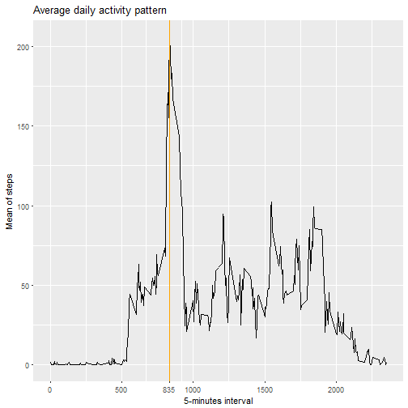
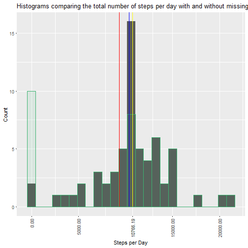
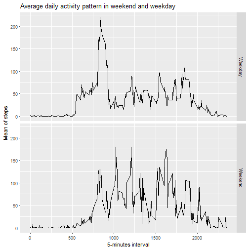

# Reproducible Research - Course Project 1


## Introduction


It is now possible to collect a large amount of data about personal movement using activity monitoring devices such as a Fitbit, Nike Fuelband, or Jawbone Up. These type of devices are part of the “quantified self” movement – a group of enthusiasts who take measurements about themselves regularly to improve their health, to find patterns in their behavior, or because they are tech geeks. But these data remain under-utilized both because the raw data are hard to obtain and there is a lack of statistical methods and software for processing and interpreting the data.


This assignment makes use of data from a personal activity monitoring device. This device collects data at 5 minute intervals through out the day. The data consists of two months of data from an anonymous individual collected during the months of October and November, 2012 and include the number of steps taken in 5 minute intervals each day.


### Variables


The variables included in this dataset are:

- steps: Number of steps taking in a 5-minute interval (missing values are coded as NA)
- date: The date on which the measurement was taken in YYYY-MM-DD format
- interval: Identifier for the 5-minute interval in which measurement was taken


***


## Loading and processing the data


Initially, we read the data that is saved in .csv in the path defined in the "path" variable.


```r
path <- "C:\\Users\\maquina8-pc\\Documents\\COURSERA\\5. Reproducible Research\\Week 2\\course project 1\\activity.csv"
df <- read.csv(file = path, header = T)

# Converting to Date format
df$date <- as.Date(df$date)

summary(df)
```

```
##      steps             date               interval     
##  Min.   :  0.00   Min.   :2012-10-01   Min.   :   0.0  
##  1st Qu.:  0.00   1st Qu.:2012-10-16   1st Qu.: 588.8  
##  Median :  0.00   Median :2012-10-31   Median :1177.5  
##  Mean   : 37.38   Mean   :2012-10-31   Mean   :1177.5  
##  3rd Qu.: 12.00   3rd Qu.:2012-11-15   3rd Qu.:1766.2  
##  Max.   :806.00   Max.   :2012-11-30   Max.   :2355.0  
##  NA's   :2304
```

## What is mean total number of steps taken per day?

The histogram below serves to answer this question. The blue line marks where the median is the total number of steps per day and the red line marks the mean.


```r
# Calculating the total steps per day
sum_day <- aggregate(df$steps, by=list(df$date), FUN=sum, na.rm=TRUE)
sum_day <- as.data.frame(sum_day)
colnames(sum_day) <- c("Day","Total")

# Calculating the mean of the total steps per day
mean_day <- mean(sum_day$Total, na.rm=T)

# Calculating the median of the total steps per day
med_day <- median(sum_day$Total, na.rm=T)

# Plotting
ggplot(data=sum_day, aes(x = sum_day$Total)) +
    geom_histogram(bins = 25) +
    labs(title="Histogram of the total number of steps per day",
         x="Steps per Day", y="Count") +
    geom_segment(x=mean_day, y=0, xend=mean_day, yend=Inf, col="red") +
    geom_segment(x=med_day, y=0, xend=med_day, yend=Inf, col="blue") + 
    scale_x_continuous(breaks = c(0,5000,mean_day,med_day,15000,20000)) +
    theme(axis.text.x = element_text(angle = 90, hjust = 1, vjust = 0.5)) 
```


So we conclude that the average number of total steps per day is 9354.23 and the mean is 10395.


## What is the average daily activity pattern?


```r
# Calculating the mean of steps per 5-minutes interval
pattern <- aggregate(df$steps, by=list(df$interval), FUN=mean, na.rm=T)
pattern <- as.data.frame(pattern)
colnames(pattern) <- c("interval","mean")

# Saving the 5-minutes interval containing the highest mean of steps
ymax <- max(pattern$mean)
xmax <- pattern$interval[pattern$mean == ymax]

# Plotting
ggplot(data = pattern, aes(x=pattern$interval, y=pattern$mean)) +
    geom_line() + labs(title="Average daily activity pattern",
                       x="5-minutes interval", y="Mean of steps") +
    scale_x_continuous(breaks = c(0,500, xmax, 1000, 1500, 2000)) + 
    geom_segment(x=xmax,y=-Inf,xend=xmax,yend=Inf, col="orange")
```



In the plot above we can observe that the 5-minutes interval that contains the greater number of steps is the interval 835, containing in average 206.17 steps.


## Imputing missing values


Note that there are a number of days/intervals where there are missing values (coded as NA). The presence of missing days may introduce bias into some calculations or summaries of the data.


```r
# Getting the missing data number
t <- as.data.frame(table(is.na(df$steps)))
colnames(t) <- c("Is missing data?","Count")
t
```

```
##   Is missing data? Count
## 1            FALSE 15264
## 2             TRUE  2304
```


To solve this vies, we will impute the missing data using the mean steps of that 5-minute interval.


```r
# Making a copy of the data frame
df2 <- df

# Imputing missing values
for(i in 1:nrow(df2)){
    if(is.na(df2$steps[i]) == T){
        df2$steps[i] <- pattern[pattern$interval == df2$interval[i],2]
    }
}

# Checking missing values
t2 <- as.data.frame(table(is.na(df2$steps)))
colnames(t2) <- c("Is missing data?","Count")
t2
```

```
##   Is missing data? Count
## 1            FALSE 17568
```

In order to observe the change that the imputation of missings caused in the data, below is the histogram of the total number of steps per day after the imput missings values in gray and the histogram with missings in green for comparison purposes.


```r
# Calculating the total steps per day
sum_day2 <- aggregate(df2$steps, by=list(df2$date), FUN=sum, na.rm=TRUE)
sum_day2 <- as.data.frame(sum_day2)
colnames(sum_day2) <- c("Day","Total")

# Calculating the mean of the total steps per day
mean_day2 <- mean(sum_day2$Total, na.rm=T)

# Calculating the median of the total steps per day
med_day2 <- median(sum_day2$Total, na.rm=T)

# Plotting
ggplot(data=sum_day2, aes(Total)) +
    geom_histogram(data = sum_day2, bins = 25) + 
    geom_histogram(data = sum_day, col="mediumseagreen", fill="mediumseagreen", bins = 25, alpha=0.1) +
    labs(title="Histograms comparing the total number of steps per day with and without missings",
         x="Steps per Day", y="Count") +
    geom_segment(x=mean_day2, y=0, xend=mean_day2, yend=Inf, col="blue") +
    geom_segment(x=med_day2, y=0, xend=med_day2, yend=Inf, col="yellow") + 
    scale_x_continuous(breaks = c(0,5000,mean_day2,med_day2,15000,20000)) +
    theme(axis.text.x = element_text(angle = 90, hjust = 1, vjust = 0.5)) +
    geom_segment(x=mean_day, y=0, xend=mean_day, yend=Inf, col="red") +
    geom_segment(x=med_day, y=0, xend=med_day, yend=Inf, col="blue")
```



The yellow line represents the mean (10766.19) and median (10766.19) of the new data set. The red and blue lines represent the mean (9354.23) and median (10395) of the old data set, still with the missings.


## Are there differences in activity patterns between weekdays and weekends?

In the panel plot below we can observe the average number of steps given every weekdays or weekends.


```r
df2$weekdays <- ifelse(weekdays(df2$date) %in% c("sábado","domingo"), 2, 1)
df2$weekdays <- as.factor(df2$weekdays)
levels(df2$weekdays) <- c("Weekday","Weekend")

pattern2 <- aggregate(df2$steps, by=list(df2$interval,df2$weekdays), FUN=mean, na.rm=T)
pattern2 <- as.data.frame(pattern2)
colnames(pattern2) <- c("interval","weekday","mean")

# Plotting
ggplot(data = pattern2, aes(x=pattern2$interval, y=pattern2$mean)) +
    geom_line() + facet_grid(pattern2$weekday~.) +
    labs(title="Average daily activity pattern in weekend and weekday",
                       x="5-minutes interval", y="Mean of steps")
```




***

*Note: English is not my native language, so  I'm sorry if have text errors.*

***
